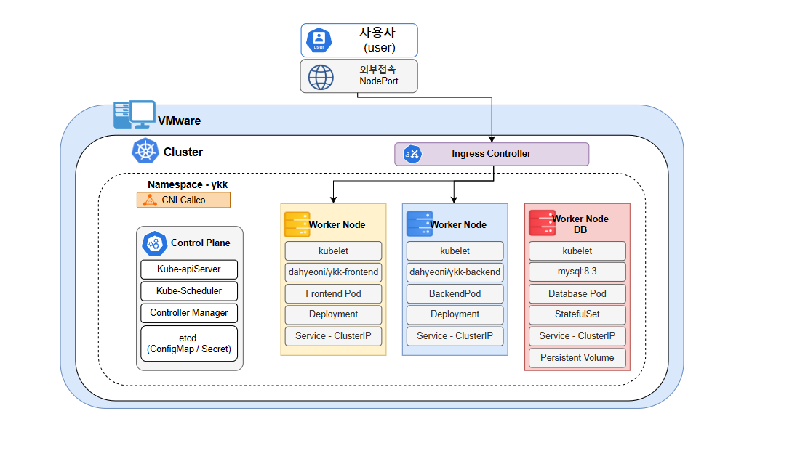

# 영ㅋㅋ - 1550 적금

## 프로젝트 개요
> 멋쟁이사자처럼 클라우드 인프라 6기
> 
> 제 1차 프로젝트 1조 "**영ㅋㅋ**(YKK)"

VMware를 이용하여 가상 서버 환경을 구축하고, Docker를 통한 컨테이너화와 Kubernetes를 활용한 컨테이너 오케스트레이션 환경을 구성하는 것을 목표로 프로젝트를 수행하였습니다. 구축한 Kubernetes 클러스터에 금융 서비스를 배포하여 실제 운영 환경과 유사한 구조를 구현하였으며, 서비스 배포, 네트워크 구성, 스토리지 연동 등 클라우드 네이티브 환경의 운영 과정을 실습하였습니다.

서비스 주제로는 기본 금융 서비스를 선정하였으며 기본적인 입출금 기능과 함께 외환 적금 기능을 구현하여 환율 정보를 기반으로 한 적금 가입 서비스를 제공하도록 개발하였습니다.

## 아키텍처 다이어그램

  

- ***[draw.io 아키텍처](https://drive.google.com/file/d/1TRx4iO2XgHTS7GYg05X4SP0xn8MOt9aR/view)***

### 역할

| Name | Job | Path | Stack |
| -------- | ------ | ----- | ----- |
| 최윤혁 (팀장)   | Frontend Application 개발, VM-OS 관리 |/frontend|   |
| 김다현 (부팀장) | Docker/Git 저장소 관리, 연동 테스트 |/docker|    |
| 정우진 (팀원) | Kubernetes 인프라 설계, 환경 테스트 |/kubernetes|    |/frontend|
| 탁원준 (팀원) | Backend API Server 개발 |/backend|    |

